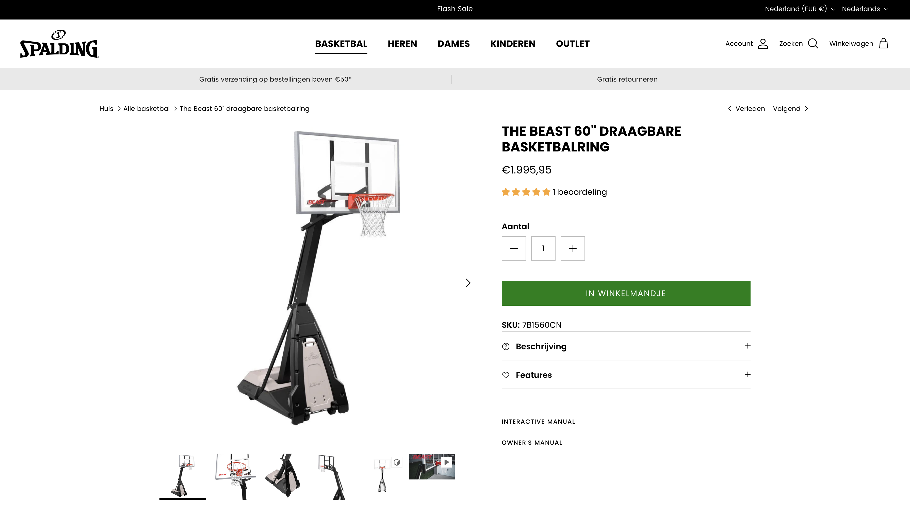
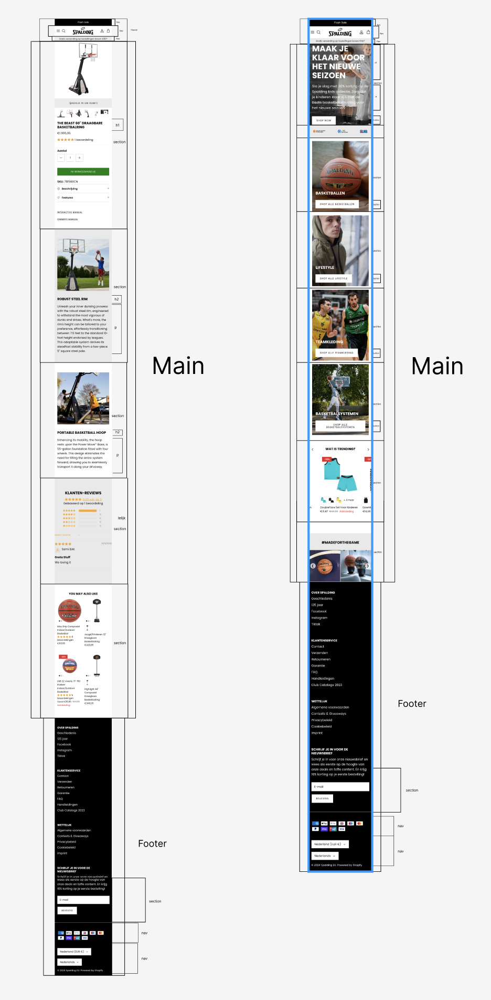

# Procesverslag

Markdown is een simpele manier om HTML te schrijven.  
Markdown cheat cheet: [Hulp bij het schrijven van Markdown](https://github.com/adam-p/markdown-here/wiki/Markdown-Cheatsheet).

Nb. De standaardstructuur en de spartaanse opmaak van de README.md zijn helemaal prima. Het gaat om de inhoud van je procesverslag. Besteedt de tijd voor pracht en praal aan je website.

Nb. Door _open_ toe te voegen aan een _details_ element kun je deze standaard open zetten. Fijn om dat steeds voor de relevante stuk(ken) te doen.

## Jij

  
uitwerken voor kick-off werkgroep

### Auteur:

Lev van Oers

#### Je startniveau:

Blauw en misschien een klein stukje rood

#### Je focus:

surface plane

## Je website

  
uitwerken voor kick-off werkgroep

### Je opdracht:

Spalding basketbal: https://spalding-basketball.com/en-nl

#### Screenshot(s) van de eerste pagina (small screen):

main page

#### Screenshot(s) van de tweede pagina (small screen):

hier de naam van de pagina  
 

## Toegankelijkheidstest 1/2 (week 1)

  
uitwerken na test in 2e werkgroep

### Bevindingen

-voiceover is heel luid.
-voiceover is bijna niet te volgen
-alt tag is een beetje vaag bij fotos
-hij is niet optimaal responsive want sommige letters zijn niet te lezen op telefoon

## Breakdownschets (week 1)

  
uitwerken na afloop 3e werkgroep

### de hele pagina:

  

foto van allebei de paginas

## Voortgang 1 (week 2)

  
uitwerken voor 1e voortgang

### Stand van zaken

Ik loop een klein beetje achter, maar dat ga ik dit weekend uiteraard fixen. Ik vind sommige dingen nog best lastig, bijvoorbeeld hoe ik aan bepaalde img's kom. maar dat kan ik vragen in de les.

### Agenda voor meeting

samen met je groepje opstellen
Lev van Oers:

vragen voor de feedback meeting:

1. Waarom is javascript gelinkt in de body?
2. Hoe kan ik producten laten zien door met een knopje naar rechts of links te klikken?
3. Hoe maak je een vakje waar je in kan typen
4. Hoe kan ik de foto van de site dowloaden.

### Verslag van meeting

hier na afloop snel de uitkomsten van de meeting vastleggen

-   punt 1
-   punt 2
-   nog een punt
-   ...

## Voortgang 2 (week 3)

  
uitwerken voor 2e voortgang

### Stand van zaken

ik loop aardig wat achter en struggle best veel met de css. ik heb weinig tijd gehad deze week, maar nog steeds alle tijd die
ik had besteed. Helaas was dat niet genoeg. Maar het moet wel goedkomen

### Agenda voor meeting

samen met je groepje opstellen

| student 1      | student 2          | student 3    | student 4        |
| -------------- | ------------------ | ------------ | ---------------- |
| dit bespreken  | en dit             | en ik dit    | en dan ik dat    |
| en dat ook nog | dit als er tijd is | nog een punt | dit wil ik zeker |
| ...            | ...                | ...          | ...              |

### Verslag van meeting

hier na afloop snel de uitkomsten van de meeting vastleggen

-   Pls help mij met mijn footer. Ik weet niet hoe ik de list items onder elkaar kan krijgen
-   Hoe maak een slide systeempje

## Toegankelijkheidstest 2/2 (week 4)

  
uitwerken na test in 9e werkgroep

### Bevindingen

Lijst met je bevindingen die in de test naar voren kwamen (geef ook aan wat er verbeterd is):

## Voortgang 3 (week 4)

  
uitwerken voor 3e voortgang

### Stand van zaken

hier dit ging goed & dit was lastig (neem ook screenshots op van delen van je website en code)

### Agenda voor meeting

samen met je groepje opstellen

| student 1      | student 2          | student 3    | student 4        |
| -------------- | ------------------ | ------------ | ---------------- |
| dit bespreken  | en dit             | en ik dit    | en dan ik dat    |
| en dat ook nog | dit als er tijd is | nog een punt | dit wil ik zeker |
| ...            | ...                | ...          | ...              |

### Verslag van meeting

hier na afloop snel de uitkomsten van de meeting vastleggen

-   punt 1
-   punt 2
-   nog een punt
-   ...

## Eindgesprek (week 5)

  
uitwerken voor eindgesprek

### Je uitkomst - karakteristiek screenshots:

  

### Dit ging goed/Heb ik geleerd:

Korte omschrijving met plaatjes

  

### Dit was lastig/Is niet gelukt:

Korte omschrijving met plaatjes

  

## Bronnenlijst

  
continu bijhouden terwijl je werkt

Nb. Wees specifiek ('css-tricks' als bron is bijv. niet specifiek genoeg).
Nb. ChatGpT en andere AI horen er ook bij.
Nb. Vermeld de bronnen ook in je code.

1. bron 1
2. bron 2
3. ...

